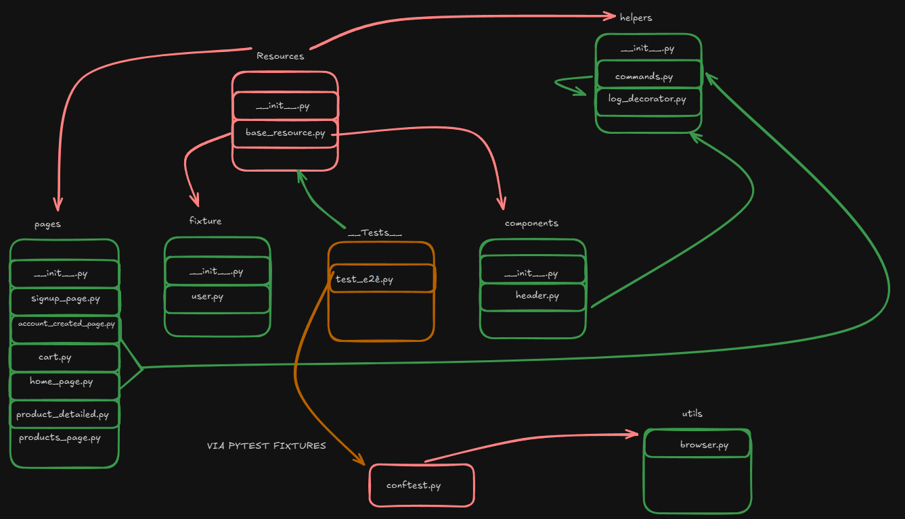

# Projeto de automação Selenium/Python + Page Objects

### Requisitos para iniciar o projeto

- Python: 3.13.0
- Node: ^20

### Como executar o projeto

1. Vá para o diretório principal com o python instalado e digite `python -m venv .venv` para criar o ambiente virtual
2. Ao criar o ambiente virtual, use `.\.venv\Scripts\activate` caso utilize Windows,  e `source .\.venv\Scripts\activate` caso utilize Linux
3. Ao acessar o ambiente virtual, instale as bibliotecas utilizando o comando `pip install -r requirements.txt` o PIP fará a instalação de todas dependências necessárias para executar o projeto
4. Assim que finalizado, no diretório principal, use o comando `pytest` que o teste será executado.
    1. A configuração inicial está para ser executado em Headless (Sem interface gráfica), caso queira visualizar o teste sendo executado, abra o arquivo “`conftest.py`" na linha 14 e comente/apague essa linha e execute o teste novamente. (**Lembre-se de salvar**) 

### **🧱 Visão geral da arquitetura:**

A arquitetura foi baseada em modelo Page Objects, utilizando a classe e módulo **Resource** para ser o “hub” do projeto, contendo todos dados modelos que são acessíveis a partir de qualquer test criado.

O motivo pela escolha deste modelo se dá por conta de que ao ter feito os testes e a construção deles em um modelo seguindo a ideia de fazer um page objects, esbarrei em alguns problemas, principalmente relacionados a importação circular, portanto, foi feito o desenho do projeto de testes a fim de visualmente clarear a ideia do projeto e ser possível implementar as correções necessárias.

### Segue um detalhamento de cada classe/módulo individualmente

### 📂 `pages/`

- Contém os **Page Objects**.
- Arquivos como `signup_page.py`, `cart.py`, `products_page.py` representam páginas da aplicação web.
- Cada classe encapsula elementos e comportamentos da página, promovendo **reutilização e manutenção fácil**.

### 📂 `components/`

- Contém componentes reutilizáveis (ex: `header.py`) que aparecem em várias páginas.
- Útil quando há partes comuns do layout que precisam de validações ou interações.

### 📂 `fixture/`

- Guarda **dados e instâncias de apoio**, como `user.py` que pode conter usuários de teste ou fixtures para `pytest`.

### 📂 `Resources/`

- Contém recursos e classes base, `base_resource.py`, que encapsula as instâncias de cada página dentro da classe BaseResource

### 📂 `helpers/`

- Agrupa **funções utilitárias e decoradores**, como `commands.py` e `log_decorator.py`, que ajudam a tornar o código mais DRY (Don't Repeat Yourself).

### 📂 `__Tests__/`

- Guarda os arquivos de testes em si. Por exemplo: `test_e2e.py`.
- Os testes consomem os recursos de `conftest.py`  para fixtures do pytest, e **Resources** para utilizar os métodos e funções do projeto

### 📂 `utils/`

- Armazena os módulos úteis para o sistema como por exemplo: `browser.py`.

### 📄 `conftest.py`

- Arquivo padrão do `pytest` para declarar **fixtures compartilhadas**, configurações, e ganchos (`hooks`).
- Centraliza o que é comum entre diferentes testes.

## Report com Allure

Para verificar o report com allure utilize o comando `pytest --alluredir allure-results` para executar um teste e gerar os resultados com allure.

Instale o allure com o Node:

1. npm init -y
2. npm install allure-commandline
3. npx allure serve .\allure-results\

---

# Executando os testes de API via CLI utilizando Bruno

**Requisitos:**

- Node: ^20
1. npm init -y 
2. npm install @usebruno/cli
3. Vá até o diretório da api: `cd ./__Tests__/api`
4. Execute `npx bru run --env-file .\environments\serverest-dev.bru  --reporter-html results.html` para rodar os testes e gerar um relatório em HTML
    1. Outras opções de executar são: `npx bru run --env-file .\environments\serverest-dev.bru --reporter-json results.json --reporter-junit results.xml --reporter-html results.html`
5. Os testes serão executados em linha de comando